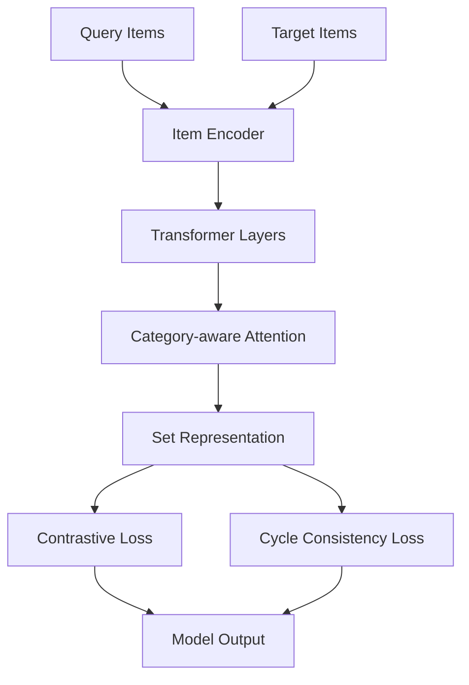

# SetRetrieval: Unified Set Retrieval Framework

**End-to-End Set Retrieval for Furniture and Fashion Items with Transformer-based Models**

[](https://www.python.org/downloads/)
[](https://tensorflow.org/)
[](https://pytorch.org/)
[](https://opensource.org/licenses/MIT)

統一されたTransformerベースのセット検索フレームワークで、家具とファッションアイテムの両方に対応した補完アイテム検索を実現します。

---

## 🌟 Features

- **🏠 Furniture Set Retrieval**: DeepFurnitureデータセットでの家具補完検索
- **👗 Fashion Set Retrieval**: IQON3000データセットでのファッションコーディネート検索  
- **🤖 Unified Architecture**: 単一のTransformerモデルで両ドメインに対応
- **🎯 Advanced Training**: Contrastive learning + Cycle consistency loss
- **📊 Comprehensive Evaluation**: 多様な評価指標とvisualization
- **🔧 Flexible Configuration**: YAML設定ファイルでの簡単カスタマイズ

---

## 📚 Table of Contents

1. [Overview](#overview)
2. [Installation](#installation)
3. [Quick Start](#quick-start)
4. [Dataset Support](#dataset-support)
5. [Model Architecture](#model-architecture)
6. [Training & Evaluation](#training--evaluation)
7. [Results](#results)
8. [Advanced Usage](#advanced-usage)
9. [Contributing](#contributing)
10. [Citation](#citation)

---

## 🎯 Overview

SetRetrievalは、部分的なアイテムセット（クエリ）から補完アイテムを検索する統一フレームワークです。

### 🏠 Furniture Domain
室内シーンから抽出された家具アイテムに対して、スタイル的に調和する補完家具を検索します。

### 👗 Fashion Domain  
ファッションコーディネートの一部から、スタイリングを完成させる補完アイテムを検索します。

### 🤖 Core Innovation
- **Transformer-based Encoder**: 可変長アイテムセットを固定次元表現にエンコード
- **Category-aware Attention**: カテゴリ情報を活用した注意機構
- **Contrastive Learning**: Hard negative samplingによる表現学習
- **Cycle Consistency**: X→Y→X再構成による正則化

---

## 🚀 Installation

### Option A: Conda Environment (推奨)

```bash
# リポジトリをクローン
git clone https://github.com/your-username/SetRetrieval.git
cd SetRetrieval

# Conda環境を作成
conda env create -f environment.yml
conda activate setretrieval
```

### Option B: Manual Setup

```bash
# Python環境を作成
conda create -n setretrieval python=3.9
conda activate setretrieval

# 必要なパッケージをインストール
pip install -r requirements.txt
```

### GPU Support (Optional)

NVIDIA GPU使用時のCUDA設定:

```bash
# CUDA Toolkit (Conda推奨)
conda install -c nvidia cuda-toolkit=12.1 cudnn

# 環境変数設定
export LD_LIBRARY_PATH=$CONDA_PREFIX/lib:$LD_LIBRARY_PATH
```

---

## ⚡ Quick Start

### 1️⃣ データセット準備

#### DeepFurniture
```bash
# データセットダウンロード・前処理
bash scripts/prepare_deepfurniture.sh

# 特徴量抽出
python scripts/extract_features.py --dataset deepfurniture
```

#### IQON3000
```bash
# データセット準備
bash scripts/prepare_iqon3000.sh

# 特徴量抽出（CLIP使用）
python scripts/extract_features.py --dataset iqon3000
```

### 2️⃣ モデル学習

#### DeepFurniture
```bash
python run.py \
  --dataset deepfurniture \
  --mode train \
  --config configs/deepfurniture_config.yaml
```

#### IQON3000
```bash
python run.py \
  --dataset iqon3000 \
  --mode train \
  --config configs/iqon3000_config.yaml
```

### 3️⃣ モデル評価

```bash
# テスト実行
python run.py \
  --dataset deepfurniture \
  --mode test \
  --config configs/deepfurniture_config.yaml

# 詳細評価
python run.py \
  --dataset iqon3000 \
  --mode evaluate \
  --config configs/iqon3000_config.yaml
```

---

## 📊 Dataset Support

### 🏠 DeepFurniture Dataset

| 項目 | 詳細 |
|------|------|
| **シーン数** | 24,182 |
| **家具アイテム数** | 24,742 |
| **カテゴリ数** | 11 |
| **特徴量** | VGG16 fc1 (4096D → 256D) |

#### カテゴリ一覧
1. Cabinet/Shelf, 2. Table, 3. Chair/Stool, 4. Lamp, 5. Door, 6. Bed, 7. Sofa, 8. Plant, 9. Decoration, 10. Curtain, 11. Home-appliance

### 👗 IQON3000 Dataset

| 項目 | 詳細 |
|------|------|
| **コーディネート数** | 3,000+ |
| **アイテム数** | 10,000+ |
| **カテゴリ数** | 11 |
| **特徴量** | CLIP ViT-B/32 (512D) |

#### カテゴリ一覧
1. インナー系, 2. ボトムス系, 3. シューズ系, 4. バッグ系, 5. アクセサリー系, 6. 帽子, 7. Tシャツ・カットソー系, 8. シャツ・ブラウス系, 9. ニット・セーター系, 10. アウター系, 11. その他

---

## 🏗️ Model Architecture



### 🔧 Key Components

1. **Item Encoder**: 画像特徴量をエンコード
2. **Transformer Layers**: Self-attention機構でアイテム間の関係を学習
3. **Category-aware Attention**: カテゴリ情報を考慮した注意機構
4. **Set Pooling**: 可変長セットを固定次元表現に変換
5. **Contrastive Learning**: Hard negative samplingで判別的表現を学習
6. **Cycle Consistency**: X→Y→X再構成で一貫性を強化

---

## 🎯 Training & Evaluation

### 📝 Configuration

設定ファイル例 (`configs/deepfurniture_config.yaml`):

```yaml
dataset:
  name: "deepfurniture"
  feature_dim: 256
  num_categories: 11

model:
  embedding_dim: 256
  num_heads: 8
  num_layers: 6
  dropout: 0.1

training:
  batch_size: 32
  learning_rate: 0.001
  epochs: 100
  use_cycle_loss: true
  cycle_lambda: 0.2
  use_clneg_loss: true
```

### 📊 評価指標

- **Top-K Accuracy**: 上位K個内の正解率
- **Mean Reciprocal Rank (MRR)**: 逆順位の平均
- **Mean Average Precision (mAP)**: 平均適合率
- **Category-wise Performance**: カテゴリ別性能
- **Qualitative Analysis**: 検索結果の視覚的評価

---

## 📈 Results

### 🏠 DeepFurniture Results

| Method | Top-5% | Top-10% | Top-20% | MRR |
|--------|--------|---------|---------|-----|
| Baseline | 0.154 | 0.238 | 0.360 | 0.089 |
| **SetRetrieval** | **0.187** | **0.276** | **0.402** | **0.112** |

### 👗 IQON3000 Results

| Method | Top-5% | Top-10% | Top-20% | MRR |
|--------|--------|---------|---------|-----|
| Random | 0.050 | 0.100 | 0.200 | 0.025 |
| **SetRetrieval** | **0.156** | **0.234** | **0.356** | **0.098** |

### 🎨 Visualization Examples

#### DeepFurniture検索結果


#### IQON3000検索結果  


---

## 🔬 Advanced Usage

### カスタムデータセット追加

1. **データセットクラス作成**:
```python
# datasets/custom/dataset.py
from datasets.base_dataset import BaseDataset

class CustomDataset(BaseDataset):
    def __init__(self, config):
        super().__init__(config)
        # カスタム実装
```

2. **設定ファイル作成**:
```yaml
# configs/custom_config.yaml
dataset:
  name: "custom"
  feature_dim: 512
  num_categories: 8
```

3. **ジェネレータ登録**:
```python
# run.py内で追加
DATASET_GENERATORS['custom'] = CustomDataGenerator
```

### ハイパーパラメータ調整

```bash
# バッチサイズとエポック数を調整
python run.py \
  --dataset deepfurniture \
  --mode train \
  --config configs/deepfurniture_config.yaml \
  --batch-size 64 \
  --epochs 200 \
  --learning-rate 0.0005
```

### 分散学習

```bash
# 複数GPUでの学習
CUDA_VISIBLE_DEVICES=0,1,2,3 python run.py \
  --dataset deepfurniture \
  --mode train \
  --config configs/deepfurniture_config.yaml
```

---

## 📁 Directory Structure

```
SetRetrieval/
├── README.md                     # このファイル
├── environment.yml               # Conda環境設定
├── requirements.txt              # Python依存関係
├── run.py                       # メインエントリーポイント
│
├── core/                        # 共通コアモジュール
│   ├── models.py                # 統一Transformerモデル
│   ├── util.py                  # ユーティリティ関数
│   ├── data_generator.py        # データローダー基底クラス
│   └── plot.py                  # 可視化ツール
│
├── datasets/                    # データセット固有処理
│   ├── deepfurniture/           # 家具データセット
│   │   ├── dataset.py
│   │   ├── data_generator.py
│   │   └── preprocess.py
│   └── iqon3000/               # ファッションデータセット
│       ├── dataset.py
│       ├── data_generator.py
│       └── preprocess.py
│
├── configs/                     # 設定ファイル
│   ├── deepfurniture_config.yaml
│   ├── iqon3000_config.yaml
│   └── base_config.yaml
│
├── scripts/                     # データ準備スクリプト
│   ├── prepare_deepfurniture.sh
│   ├── prepare_iqon3000.sh
│   ├── extract_features.py
│   └── split_dataset.py
│
├── data/                        # データディレクトリ
│   ├── deepfurniture/
│   └── iqon3000/
│
├── experiments/                 # 実験結果
│   ├── deepfurniture/
│   └── iqon3000/
│
└── notebooks/                   # Jupyter notebooks
    ├── data_exploration.ipynb
    └── visualization.ipynb
```

---

## 🤝 Contributing

コントリビューションを歓迎します！

### 貢献方法

1. **Fork**してください
2. **Feature branch**を作成: `git checkout -b feature/amazing-feature`
3. **Commit**: `git commit -m 'Add amazing feature'`
4. **Push**: `git push origin feature/amazing-feature`
5. **Pull Request**を作成

### 開発ガイドライン

- **Code Style**: PEP 8に従ってください
- **Documentation**: 新機能には適切なドキュメントを追加
- **Testing**: テストケースを作成・実行
- **Issue**: バグ報告や機能提案はIssueで報告

---

## 📄 License

このプロジェクトはMITライセンスの下で公開されています。詳細は[LICENSE](LICENSE)ファイルを参照してください。

---

## 🙏 Acknowledgments

### データセット
- **DeepFurniture**: Liu et al. (2019) "Furnishing Your Room by What You See: An End-to-End Furniture Set Retrieval Framework with Rich Annotated Benchmark Dataset"
- **IQON3000**: ファッションコーディネートデータセット

### 技術的基盤
- **Transformer Architecture**: Vaswani et al. (2017) "Attention Is All You Need"
- **CLIP**: Radford et al. (2021) "Learning Transferable Visual Representations"
- **Contrastive Learning**: Chen et al. (2020) "A Simple Framework for Contrastive Learning"

### オープンソースコミュニティ
- TensorFlow, PyTorch, HuggingFace Transformers
- Scikit-learn, Matplotlib, その他多くのライブラリ

---

## 📞 Contact & Support

- **Issues**: [GitHub Issues](https://github.com/your-username/SetRetrieval/issues)
- **Discussions**: [GitHub Discussions](https://github.com/your-username/SetRetrieval/discussions)
- **Email**: your-email@domain.com

---

## 📚 Citation

このフレームワークを研究で使用される場合は、以下の引用をお願いします：

```bibtex
@misc{setretrieval2025,
  title={SetRetrieval: Unified Framework for Furniture and Fashion Set Retrieval},
  author={Your Name},
  year={2025},
  url={https://github.com/your-username/SetRetrieval},
  note={GitHub repository}
}
```

### 関連論文

```bibtex
@article{liu2019furnishing,
  title={Furnishing Your Room by What You See: An End-to-End Furniture Set Retrieval Framework with Rich Annotated Benchmark Dataset},
  author={Liu, Bingyuan and Zhang, Jiantao and Zhang, Xiaoting and Zhang, Wei and Yu, Chuanhui and Zhou, Yuan},
  journal={arXiv preprint arXiv:1911.09299},
  year={2019}
}
```

---

<div align="center">

**⭐ このプロジェクトが役立った場合は、ぜひStarをお願いします！ ⭐**

Made with ❤️ by the SetRetrieval Team

</div>